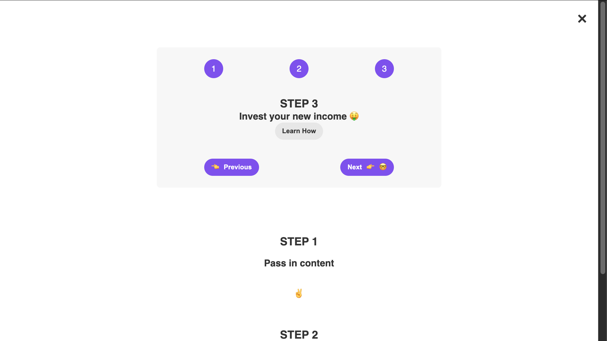
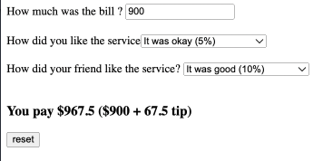

# Learning React JS

# App UI
- Pizza Menu 
  

- Steps App 
  
  

- Travel List App
  
 

- Eat And Split
  

# Practice 

- accordion
  

- date counter practice
  

- flash-cards
  

- profile-card
  

- tip-calculator
  
